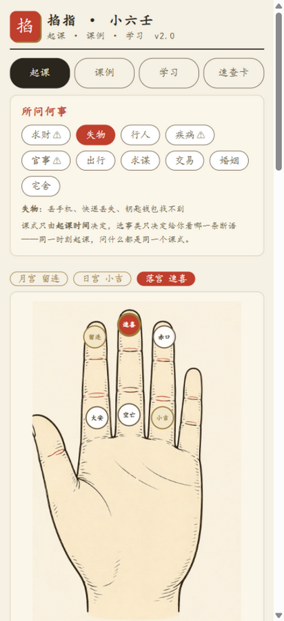
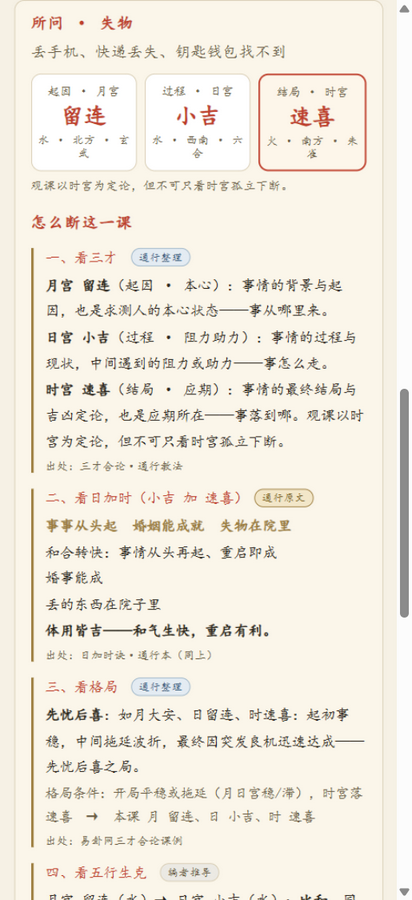
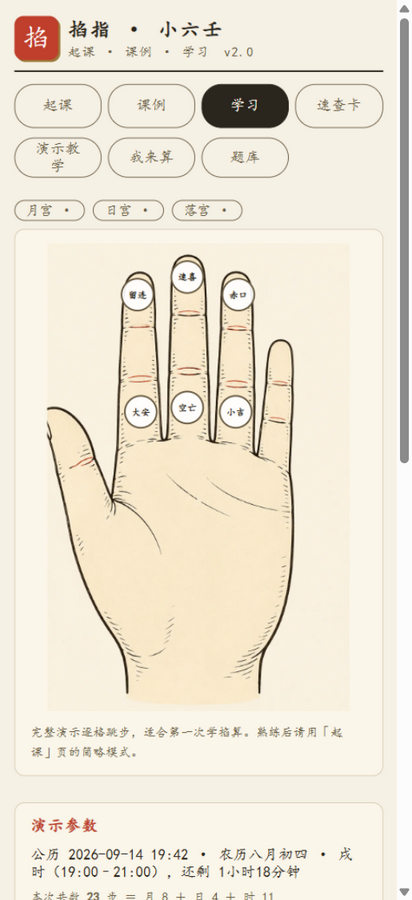
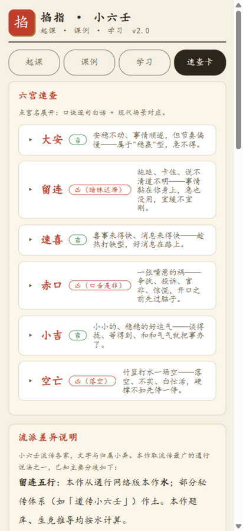

# 掐指小六壬

离线可用的小六壬（诸葛马前课）工具：**选事类 → 起课 → 出断语**，附完整教学与 269 题题库。
纯前端实现，无框架、无后端、不联网、无广告，提供 Android APK 与网页两种用法。

<p align="center">
  
  
  
  
</p>

> 断语全部摘自传统小六壬通行本并可溯源，属民俗文化内容，**不构成对任何具体事项的预测或决策建议**。
> 疾病 / 投资 / 法律三类事类会强制显示对应提示，且不可关闭。详见下方[免责声明](#免责声明)。

---

## 下载使用（安卓）

到 **[Releases](../../releases)** 下载最新的 `xiaoliuren-v*.apk`，传到手机上点击安装即可。

- 系统要求：Android 5.1（API 22）及以上
- 首次安装需要在系统里允许「安装未知来源的应用」（侧载应用都会提示，属正常）
- 覆盖安装：同一签名的后续版本可直接覆盖升级，本地记录不丢
- ⚠️ 如果你用的是**自己构建**的包（签名与官方不同），无法覆盖安装官方版，需先卸载，**卸载会清空本地记录**

> 国内下载慢的话，可以自行用仓库镜像 / 代理下载 Release 附件；APK 本身不依赖任何在线服务，装完就能离线用。

## 网页版

**在线直接用：<https://errrc.github.io/fastxiaoliuren/>**（手机浏览器打开也可以，可「添加到主屏幕」当应用用）

代码就是一堆静态文件，`index.html` 双击即可运行，也可以丢到任意静态托管：

```bash
# 本地起个服务（可选，直接双击 index.html 也行）
npx serve .
```

仓库带了 GitHub Pages 工作流（`.github/workflows/pages.yml`）：在仓库 Settings → Pages 把 Source 选成
**GitHub Actions**，之后每次 push 到 `main` 都会自动更新在线网页版（本仓库已开启）。

## 功能

| Tab | 内容 |
|---|---|
| **起课** | 选事类（求财/失物/行人/疾病/官事/出行/求谋/交易/婚姻/宅舍）→ 按当前时刻起课（月/日/时可手动改）→ 结果页给课式三宫（月宫起因·日宫过程·时宫结局）、该事类断语（口诀原文 + 白话）、四步推演（三才 → 日加时 → 格局 → 五行生克，可折叠）、免责与高危提示；可存入课例 |
| **课例** | 保存起过的课，写一句话备忘，标记复盘 |
| **学习** | 34 步掌上起课演示动画、269 题题库（9 章：超简易入门 / 六宫入门 / 宫位属性 / 口诀白话 / 断事应用 / 组合课断 / 辨析进阶 / 时辰历法 / 占卜通识）、「我来算」练习（在虚拟手掌上自己掐一遍，自动判卷） |
| **速查卡** | 六宫属性速查、时辰对照、事类对照，以及引擎自检 |

**诚实原则**：课式只由起课时间决定，你输入的事类只用于取用对应断语，**不参与任何计算**；
应用也不会声称"理解了你问的事"，更不做确定性预测。

## 隐私

- **不联网**：没有后端、没有账号、没有任何外部请求（`AndroidManifest.xml` 里的 `INTERNET` 权限是 Capacitor 模板默认带的，本项目未使用）
- **数据只在本机**：课例、练习与错题记录都存在浏览器/App 的 `localStorage`
- **无统计、无广告、无内购**

## 自己构建

完整流程、签名说明与常见坑见 **[docs/BUILD.md](docs/BUILD.md)**，最短路径：

```bash
npm install
node build-apk.js release     # 产物：dist/掐指小六壬-v<版本>.apk
```

前置条件：Node 18+、**JDK 17**（Gradle 8.2.1 不支持 JDK 21+）、Android SDK（platform 34 / build-tools 34）。
没有签名文件也能构建（自动回退 debug 签名，仅供自测）——**发布用的签名文件与密码不在仓库里**，原因见
[docs/BUILD.md 第 4 节](docs/BUILD.md#4-签名--决定能不能覆盖安装)。

跑测试：

```bash
node test.js         # 引擎/历法/数据锚点，28 项
node smoke-test.js   # jsdom 界面冒烟，25 项（改了 app.js / index.html 必跑）
```

## 目录结构

```
index.html / app.js / engine.js / palaces.js / combos.js / divine.js   应用源码（双击 index.html 即可运行）
questions/            题库源文件与合并脚本（questions.json → questions.js）
assets/palm.webp      掌图底图（第一人称视角，拇指在左）
android/              Capacitor 6 安卓工程
build-apk.js          一键打包
sync-www.js           源码 → www/（打包第一步）
docs/                 产品方案、宪法、打包指南、题库规范等文档
```

## 内容规范

- 六宫数据以 `palaces.json` 为唯一权威源，口诀与类象都可溯源到传统通行本
- 断语查询三档降级、**绝不杜撰**：口诀原句 → 单宫类象 → 组合课断，推不出的内容明确标注"编者按五行常法推导"
- 出题与改题规范见 [docs/题库接口说明.md](docs/题库接口说明.md)

## 文档

| 文档 | 内容 |
|---|---|
| [docs/BUILD.md](docs/BUILD.md) | **打包与发布指南**：环境、签名、CI、APK 分发方式、常见问题 |
| [docs/交接文档.md](docs/交接文档.md) | 项目地图与协作须知（写给接手的人 / AI） |
| [docs/产品方案-v1.0.md](docs/产品方案-v1.0.md) | 产品总方案 |
| [docs/产品宪法v2与占卜化改造方案-v0.1.md](docs/产品宪法v2与占卜化改造方案-v0.1.md) | 现行宪法 v2 与 v2.x 改造方案 |
| [docs/题库接口说明.md](docs/题库接口说明.md) | 题库数据结构与出题规范 |
| [CHANGELOG.md](CHANGELOG.md) | 版本变更记录 |

## 免责声明

本应用为传统民俗文化（小六壬）的学习与查阅工具，所有断语摘自传统通行本，仅供文化研究与娱乐参考，
**不构成医疗、投资、法律或任何其他决策建议**。涉及疾病、投资、法律等事项，请咨询相应专业人士。
使用者应对自己的行为与决定负责。

## 许可

代码以 [MIT 许可证](LICENSE) 开源。第三方组件与数据来源见 [THIRD-PARTY.md](THIRD-PARTY.md)
（农历转换使用 [solarlunar](https://github.com/isee15/Lunar-Solar-Calendar-Converter)，MIT）。
